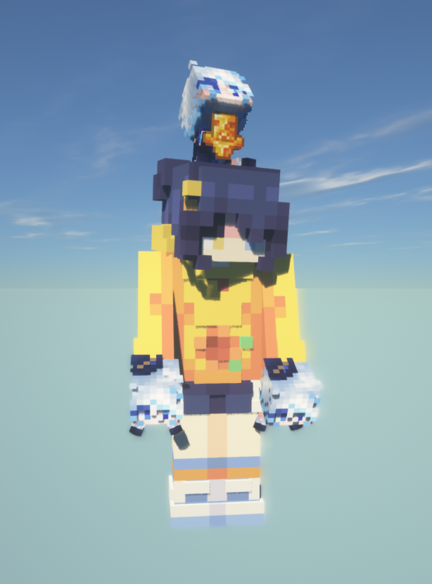
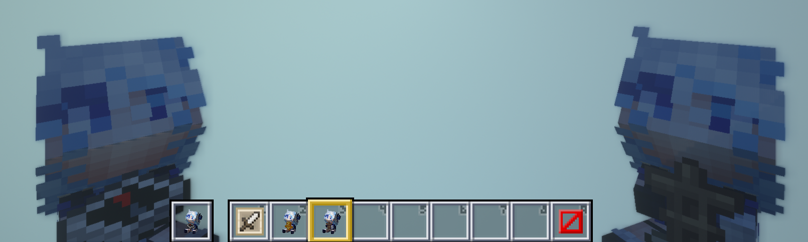

# Furina Doll
  

## 安装步骤
1. [下载](releases/latest)最新 Release 版本
2. 解压并放入 resourcepacks 文件夹
3. 在游戏资源包中选择此材质包即可

## 实机效果  
材质包：XeKr 方纹淡彩19plus4.2  
光影：SEUS  
  
  


## 可能遇到的问题
1. 下载后放入 resourcepacks 文件夹并未被游戏识别到
   > 需要解压缩
2. 将解压后的文件夹放入 resourcepacks 文件夹并未被游戏识别到
   > 请确认资源包文件夹没有出现嵌套，一个正确的文件夹嵌套层次如下
   ```
    ├───resourcepacks
    │   ├───mc.furina_doll-1.3
    │   │   │   pack.mcmeta
    │   │   │   pack.png
    │   │   └───assets
    │   │       └───minecraft
    │   │           ├───models
    │   │           │   └───item
    │   │           │           armor_stand.json
    │   │           │           compass.json
    ...
    │   │           │           compass_31.json
    │   │           │           template_doll.json
    │   │           │           totem_of_undying.json
    │   │           └───textures
    │   │               └───item
    │   │                   └───doll
    │   │                           furina.png
    ...
   ```
